# Consumer topologies

How thin-caller workflows in *consumer* repos wire up the reusable workflows and
composite actions in this repo. Every diagram below is drawn from a real consumer
so you can copy the shape that matches your repo.

These examples track the current major (`@v2`). The reference consumers shown here
(`clutterstock`, `wsh-rtl-sdr`, `proxmox`) currently pin a commit SHA of the previous
major and bump to `@v2` as part of their migration; the `test-*` repos are the
minimal canonical examples for each scenario.

## How to read these

A *thin caller* is a workflow in your repo that mostly just sets `uses:`, `with:`,
`needs:`, and an `if:` gate. The heavy lifting (build, scan, push, sign, attest,
publish) lives in this repo. There are two ways your repo touches this library, and
the distinction matters for OIDC identity:

- **Reusable workflow** (`uses:` at the **job** level, `.github/workflows/x.yml@v2`)
  — owns the job it defines. Its OIDC token carries **this repo's**
  `job_workflow_ref`, so anything it signs is signed under the shared
  `hwinther/reusable-workflows` identity.
- **Composite action** (`uses:` at the **step** level, `.github/actions/x@v2`) —
  runs **inline in your job**, so its OIDC token carries **your** repo's ref. This
  is why `sign-image` is a composite: it lets signatures bind to the consumer's
  identity. See **Consumer-side signing** below.

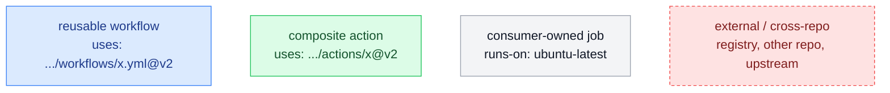

Solid arrows are `needs:` ordering (and what flows along them); dotted arrows are
data/artifacts that travel between jobs without being the primary dependency.

## The layering

Consumers almost never touch the internal (`_`-prefixed) building blocks directly —
they call a reusable workflow or a public composite, which fans out to the internals.

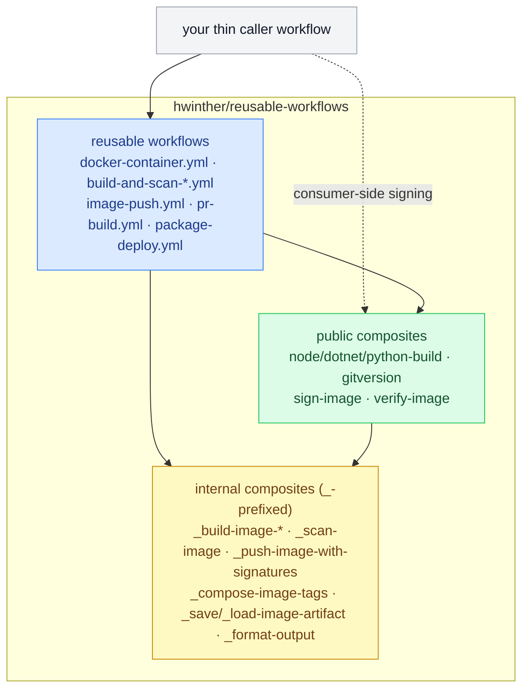

---

# Minimal examples — `test-*`

Each `test-*` repo isolates one scenario. Start here; the advanced repos are just
several of these composed together.

## Single-image container publish — `test-ghcr/web-container.yml`

Push to `main` (or manual dispatch) → one reusable job builds, scans, pushes, signs,
and attests. This is the smallest useful shape. `api-container.yml` is identical but
calls `dotnet-container.yml` (build via `dotnet publish -t:PublishContainer`).

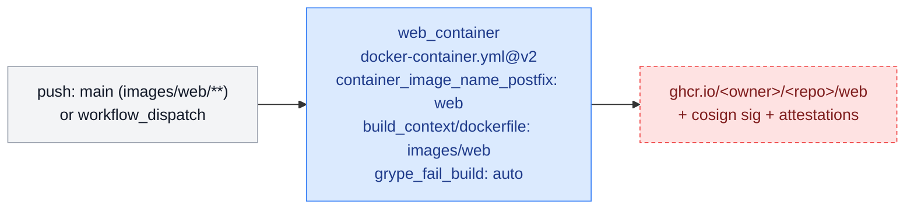

## Multi-arch + per-arch scan — `test-ghcr/multiarch-container.yml`

Same single-job shape, but `platforms: linux/amd64,linux/arm64` triggers a buildx
manifest-list build, and `scan_all_platforms: true` runs Grype against each arch
separately (distinct SARIF category per arch in Code Scanning).

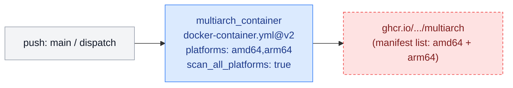

## PR container e2e → label-gated push — `test-ghcr/pr-test.yml`

The PR flow never pushes until e2e passes **and** the PR carries `deploy-feature`.
Images move between jobs as a `docker save | gzip` artifact so the **byte-identical**
content is what gets tested and later pushed. `clutterstock/pr-e2e.yml` is this same
pattern scaled to three images plus a preview deploy.

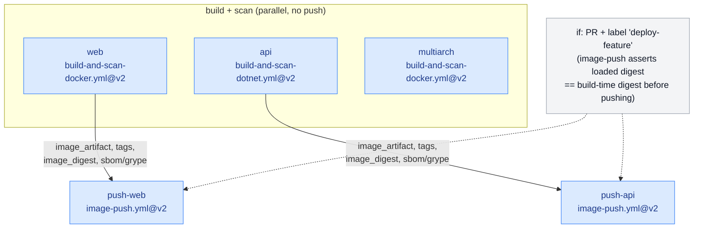

> In `test-ghcr` the e2e step is omitted (no app to drive); `clutterstock` inserts a
> `playwright-e2e.yml` job between build and push — see below.

## Consumer-side signing — `test-ghcr/web-container-consumer-signs.yml`

The canonical per-consumer-identity flow: build/scan **without** signing, push with
all sign flags off, then sign **in your own job** so the Fulcio cert SAN is your repo,
and finally verify it round-trips. Four jobs, each cross-checked against the previous.

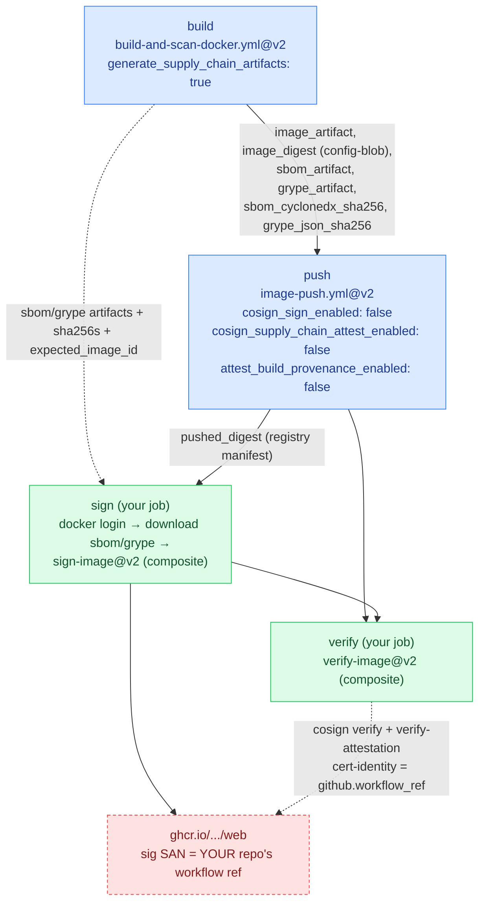

Integrity is pinned at every hop: the push job asserts the loaded image-ID matches
build, the sign job re-hashes the predicate files against `*_sha256` and checks the
CycloneDX `syft:image` binding against `expected_image_id`, cosign binds to the
registry `pushed_digest`, and verify confirms the signature exists under your identity.

> **v2 slimming:** `sign-image@v2` can download the predicates itself
> (`sbom_artifact_name` / `grype_artifact_name`) and auto-resolve the digest from the
> first `container_tags` entry — so the explicit `download-artifact` + path-resolve
> steps in the `sign` job become optional. The verbose form above still works and
> keeps the cross-job sha256 checks.

## PR build (lint / test) — `test-{npm,nuget,pypi}/*-pr.yml`

One reusable job per package, gated to the files that changed. `pr-build.yml`
auto-detects stacks; pass `node_enabled` / `dotnet_enabled` / `python_enabled`.

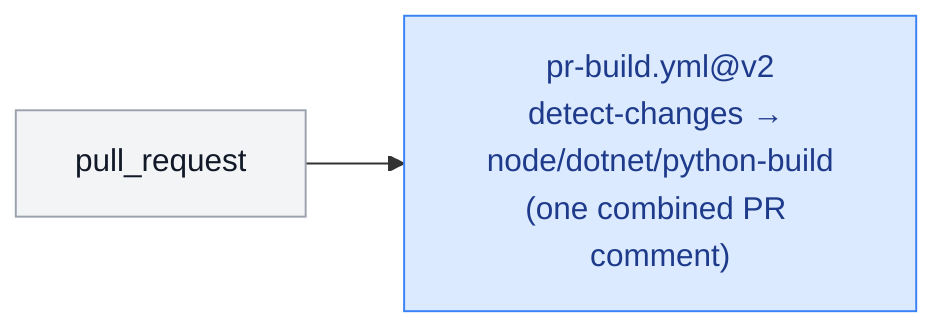

`clutterstock/ci.yml` is the multi-stack version of this (Node frontend +
`openapi-typescript` extra command, plus .NET backend, in one call).

## Package publish + fanout — `test-{npm,nuget}/*-publish.yml`

Consumers call the layer-2 `package-deploy.yml`, which computes one shared version and
fans out to the per-ecosystem deploy workflows. They do **not** call `npm-deploy.yml`
/ `nuget-deploy.yml` directly. `is_alpha` keys off PR vs `main`.

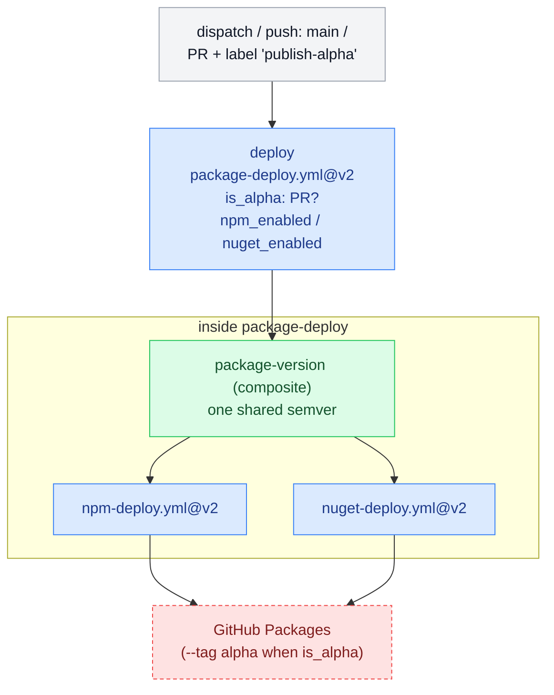

## PyPI trusted-publisher split — `test-pypi/*-publish.yml`

PyPI's OIDC trusted-publishing binds to the **calling** workflow's
`job_workflow_ref`, so the reusable side only **builds** the dist; the consumer runs
`pypa/gh-action-pypi-publish` in its **own** job (mirrors why `sign-image` is a
composite). The sdist+wheel flows across as a workflow artifact.

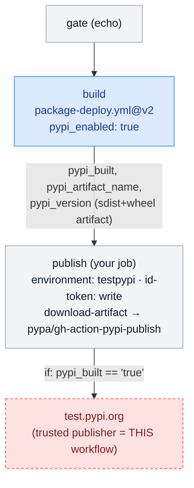

## Maintenance: registry pruning — `test-consumer/prune-*.yml`

Scheduled cleanup, thin wrappers around `prune-ghcr.yml` / `prune-npm.yml` /
`prune-nuget.yml`. Manual runs default to `dry_run: true`; the schedule forces a live
delete. Stable tags/versions and anything with a dist-tag are kept (fail-safe).

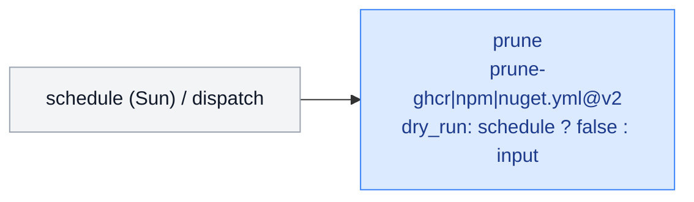

---

# Advanced — `clutterstock` (full-stack app)

A .NET API + migrator + React frontend. It composes nearly every reusable workflow:
PR build, PR container e2e with label-gated push, GitOps preview deploy, release
fan-out, and maintenance. Three deployable images (`api`, `migrator`, `frontend`)
flow through each pipeline in parallel.

## `pr-e2e.yml` — the centerpiece

Build+scan all three images (no push) → Playwright e2e against the loaded images →
**label-gated** push of the byte-identical images → render a GitOps preview overlay
into the `hwinther/proxmox` repo → comment the preview URL. Everything after e2e is
gated on the `deploy-feature` label.

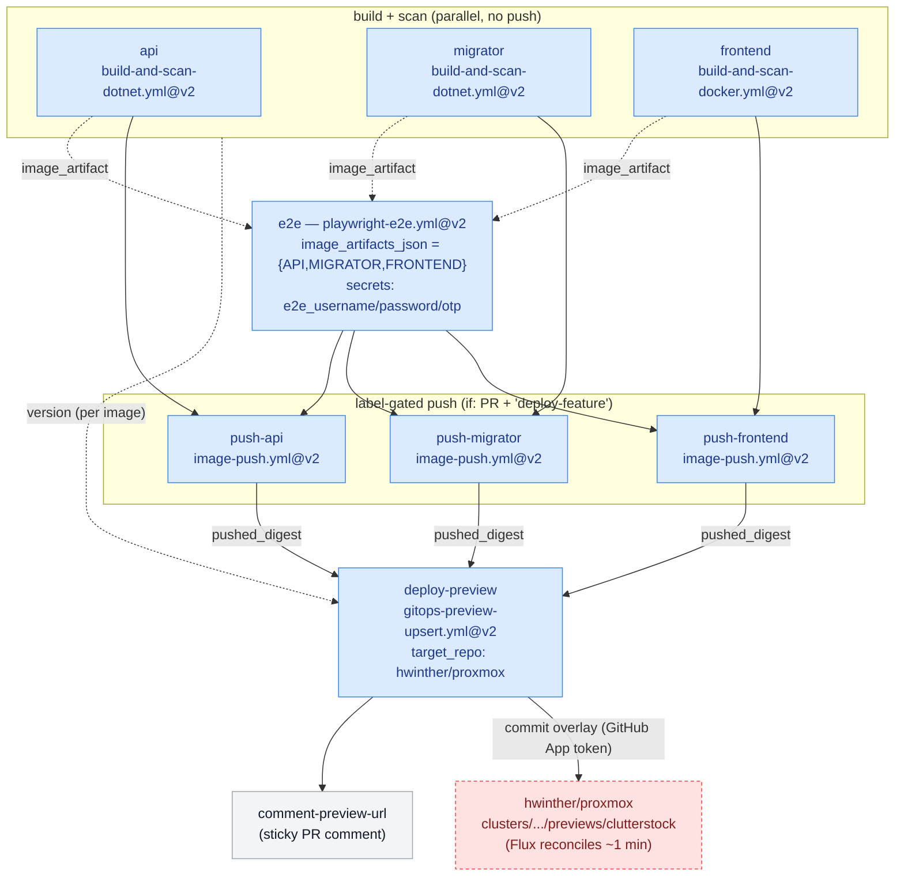

`pr-preview-cleanup.yml` is the mirror: on PR `closed`, a `teardown` job calls
`gitops-preview-teardown.yml` (removing the overlay so Flux prunes the namespace and
per-PR database), then a consumer job updates the sticky comment.

## `ci.yml` and the rest of the surface

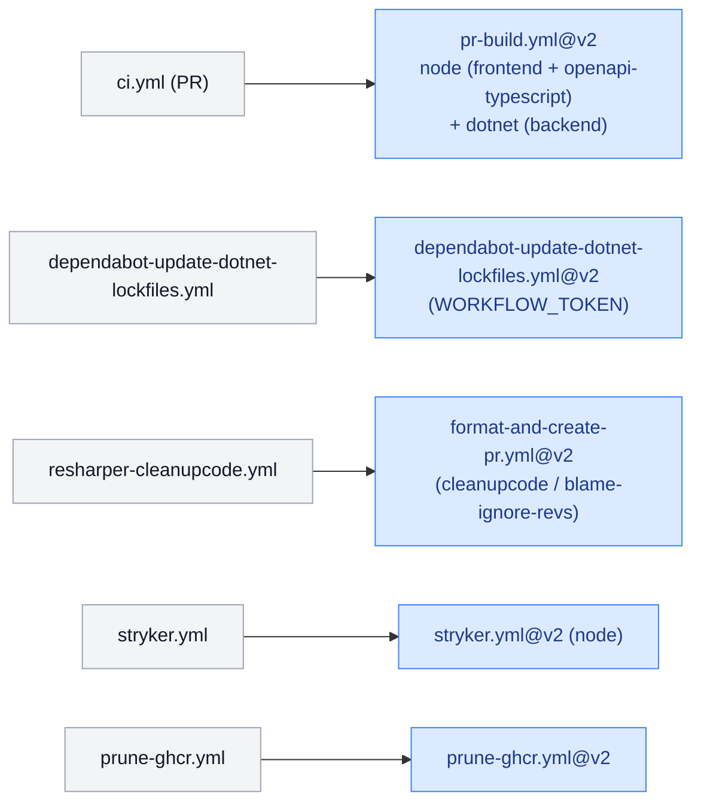

## `tag-and-release.yml` — release fan-out

Tagging with `GITHUB_TOKEN` does **not** fire other workflows' `on: push: tags`
triggers, so the release does it manually: tag via the reusable workflow, then a
consumer job resolves the new tag and `gh workflow run`s each container build at that
ref. (This same workaround appears in `wsh-rtl-sdr` and `proxmox`.)

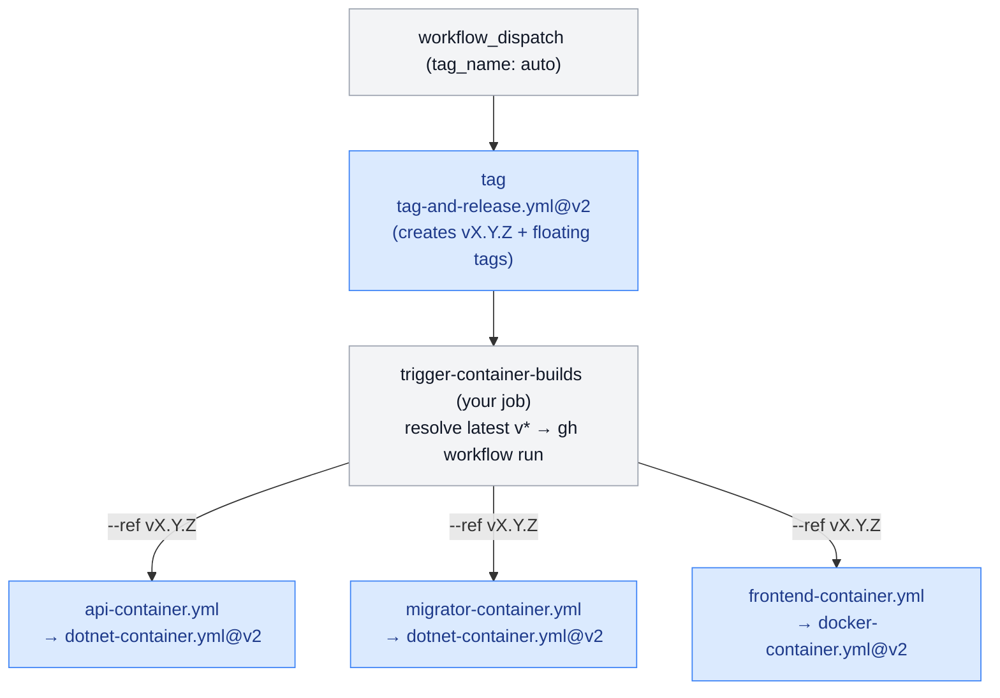

---

# Edge case — `wsh-rtl-sdr` (arm64 base image + SDR feeders)

Builds its **own** base image and a build-toolchain image, then a fleet of feeder
images derived from them — all `linux/amd64,linux/arm64`. Two things make it the
stress test for this library: **base-image chaining across a distro matrix**, and
**consumer-side signing per matrix leg**.

## `build-sdr-images.yml` — matrix chaining + consumer matrix signing

`precheck` skips the rebuild unless the upstream Debian digest moved. `sdr-build`
`needs: sdr-base` so the base is published before the toolchain `FROM`s it. Because
matrix-job outputs are last-writer-wins, the chain is wired through the
`sdr-base:<distro>` **floating tag** (passed via `build_args`), not a job output.
Signing is decoupled (`cosign_sign_enabled: false`) and done in per-distro consumer
jobs so the cert binds to `wsh-rtl-sdr`'s identity.

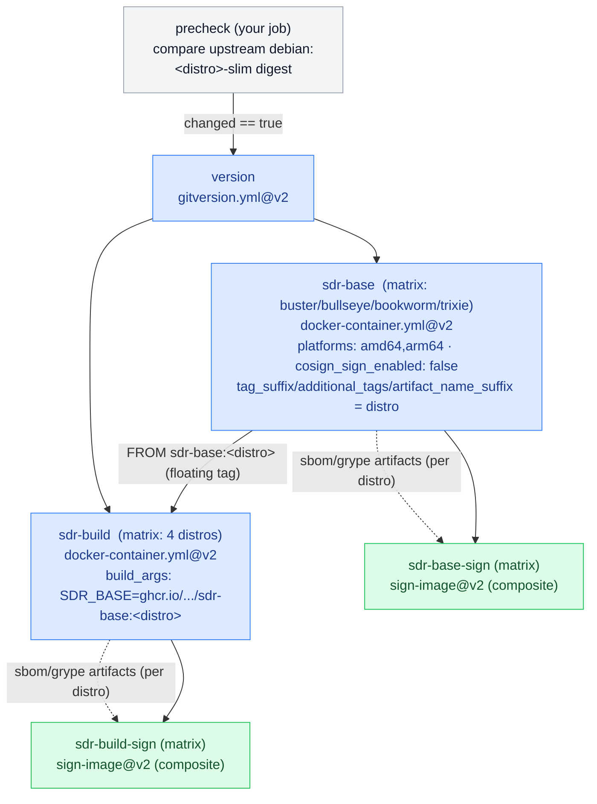

> Today each sign job installs crane, runs `crane digest`, and downloads the two
> predicate artifacts before calling `sign-image`. With `sign-image@v2` those steps
> collapse into the composite (`sbom_artifact_name`/`grype_artifact_name` + auto
> digest) — the ~100-line sign jobs become ~15 lines each.

## Feeder builds + Dockerfile digest-pinned `FROM`

Each feeder is a single `docker-container.yml` job with **reusable-side** signing.
Unlike `clutterstock`, the base→derived link is **not** a workflow output — the
feeder Dockerfile pins `FROM ghcr.io/.../sdr-base:<distro>@sha256:…` and Dependabot
bumps the digest. (Contrast with the workflow-output `image_digest` chaining shown in
the README's base-image-chaining example, which is what you'd use when base and
derived build in the **same** workflow run.)

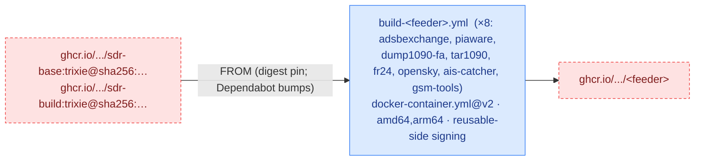

`tag-and-release.yml` dispatches the 8 feeder builds (not the base images, which
rebuild on their own path/cron cadence) — same tag→`gh workflow run` fan-out as
`clutterstock`.

---

# Edge case — `proxmox` (infrastructure / GitOps repo)

Not an app: a homelab IaC + GitOps repo (Kubernetes/Flux manifests for two clusters,
a Python provisioning library, and a couple of utility container images). It consumes
the library for the parts that *are* normal CI, and hand-rolls the
infrastructure-specific validation. It is also the **target** of `clutterstock`'s
preview deploys.

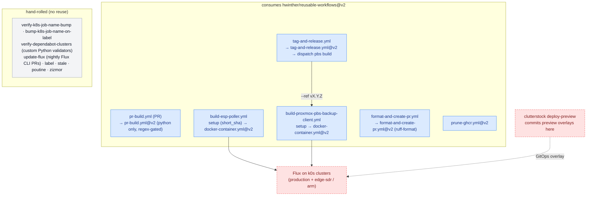

What makes it different from `clutterstock`:

- **PR build is Python-only**, gated by `python_changes_regex` to `src/`, `scripts/`,
  `pyproject.toml` — most PRs change YAML manifests, not Python.
- **Image tags carry a short SHA suffix** (`tag_suffix: <short_sha>`) so utility
  images don't collide on semver.
- **No deploy job** — "deploy" is a Flux reconcile of committed manifests, so the
  heavy machinery is the hand-rolled validators (Job-name bump enforcement, Dependabot
  cluster-dir sync, nightly Flux updates), none of which this library provides.

---

# Cross-cutting patterns

- **Release fan-out workaround.** A tag pushed by `GITHUB_TOKEN` won't trigger
  `on: push: tags` workflows. All three advanced consumers tag via
  `tag-and-release.yml`, then a consumer job resolves the tag and `gh workflow run`s
  the container builds at that ref.
- **Consumer-side signing for per-tenant identity.** Build with
  `cosign_sign_enabled: false` + `attest_build_provenance_enabled: false` (keep
  `cosign_supply_chain_attest_enabled: true` to still emit predicates), then call the
  `sign-image` **composite** in your own job. Because composites run inline, the
  Fulcio cert SAN is your repo — what per-consumer Kyverno/cosign policies need.
- **Two kinds of base-image chaining.** Same-run base→derived uses the base job's
  `image_digest` **output** as a `build_args` value (README base-image example).
  Cross-run / cross-matrix chaining (wsh-rtl-sdr) pins `FROM …@sha256:…` in the
  derived Dockerfile and lets Dependabot bump it.
- **Package fan-out + trusted publishing.** Consumers call `package-deploy.yml` (one
  shared version → per-ecosystem deploy). PyPI is special: the reusable side only
  builds the dist; the consumer runs `pypa/gh-action-pypi-publish` in its own job so
  the OIDC trusted-publisher binding stays pinned to the caller.
